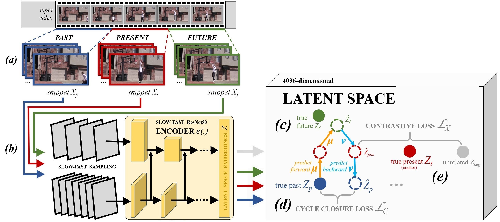

<link rel="shortcut icon" type="image/x-icon" href="favicon.ico">
<p align="center" style="font-size:30px">
<a href="https://youshye.xyz/">Xinyu Yang</a> ,  <a href="http://people.cs.bris.ac.uk/~majid//">Majid Mirmehdi</a> and <a href="http://people.cs.bris.ac.uk/~burghard/">Tilo Burghardt</a>
</p>



## Abstract

In this paper, we show that learning video feature spaces in which temporal cycles are maximally predictable benefits action classification. In particular, we propose a novel learning approach, Cycle Encoding Prediction (CEP), that is able to effectively represent the high-level spatio-temporal structure of unlabelled video content. CEP builds a latent space wherein the concept of closed forward-backwards, as well as backwards-forward, temporal loops is approximately preserved. As a self-supervision signal, CEP leverages the bi-directional temporal coherence of entire video snippets and applies loss functions that encourage both temporal cycle closure and contrastive feature separation.  Architecturally, the underpinning network architecture utilises a single feature encoder for all input videos, adding two predictive modules that learn temporal forward and backward transitions. We apply our framework for pretext training of networks for action recognition tasks and report significantly improved results for the standard datasets UCF101 and HMDB51.


## Paper

[PDF](https://youshyee.xyz/pdfs/CEP.pdf)

[ArXiv](https://arxiv.org/abs/2010.07217)

## Bibtex

```markdown
@inproceedings{yang2021back,
  title={Back to the Future: Cycle Encoding Prediction for Self-supervised Contrastive Video Representation Learning},
  author={Yang, Xinyu and Mirmehdi, Majid and Burghardt, Tilo},
  booktitle={Proc. 32nd British Machine Vision Conference (BMVC)},
  year={2021},
  organization={BMVA Press}
}
```
